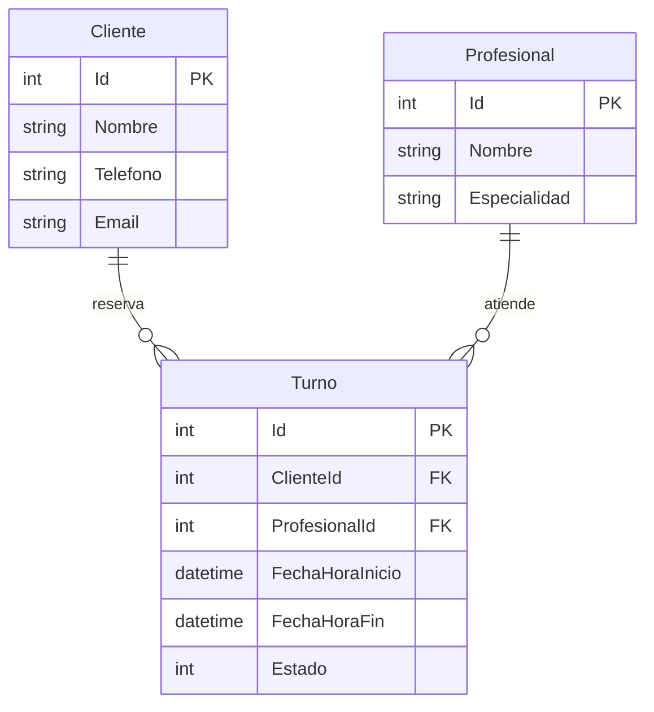

# TurnosAPI

> Sistema de gestión de turnos para consultorios, talleres o estudios: permite registrar clientes, profesionales y citas, evitando automáticamente que se superpongan horarios del mismo profesional.
> Desarrollado en **.NET 8 + Entity Framework Core + SQL Server**, con arquitectura en capas (Controllers / Services / Repositories) y consultas de negocio implementadas en Stored Procedures propios.
> Proyecto de portfolio orientado a mostrar diseño de base de datos relacional, separación de responsabilidades y buenas prácticas de API REST.

---


## Modelo de Datos

```
┌──────────────┐         ┌─────────────────────────────────────────┐         ┌─────────────────┐
│   Cliente     │         │                  Turno                  │         │   Profesional   │
├──────────────┤         ├─────────────────────────────────────────┤         ├─────────────────┤
│ Id (PK)      │◄────────│ Id (PK)                                 │────────►│ Id (PK)         │
│ Nombre       │         │ ClienteId (FK)                          │         │ Nombre          │
│ Telefono     │         │ ProfesionalId (FK)                      │         │ Especialidad    │
│ Email        │         │ FechaHoraInicio                         │         └─────────────────┘
└──────────────┘         │ FechaHoraFin                            │
                         │ Estado (0=Pendiente/1=Confirmado/2=Canc)│
                         └─────────────────────────────────────────┘
```



---

## Endpoints

| Método | Ruta | Descripción |
|--------|------|-------------|
| `GET` | `/api/clientes` | Listar todos los clientes |
| `GET` | `/api/clientes/{id}` | Obtener cliente por ID |
| `POST` | `/api/clientes` | Crear cliente |
| `PUT` | `/api/clientes/{id}` | Actualizar cliente |
| `DELETE` | `/api/clientes/{id}` | Eliminar cliente |
| `GET` | `/api/profesionales` | Listar todos los profesionales |
| `GET` | `/api/profesionales/{id}` | Obtener profesional por ID |
| `POST` | `/api/profesionales` | Crear profesional |
| `PUT` | `/api/profesionales/{id}` | Actualizar profesional |
| `DELETE` | `/api/profesionales/{id}` | Eliminar profesional |
| `POST` | `/api/turnos` | Crear turno (con validaciones de negocio) |
| `GET` | `/api/turnos/cliente/{clienteId}` | Turnos de un cliente + nombre del profesional |
| `PUT` | `/api/turnos/{id}/cancelar` | Cancelar turno (soft delete lógico) |
| `GET` | `/api/turnos/proximo-disponible` | Próximo slot libre para un profesional |

---

## Prerrequisitos

- **Visual Studio Community 2022** (o superior)
- **.NET 8 SDK** (incluido con VS 2022)
- **SQL Server LocalDB** (incluido con VS Community — workload "ASP.NET and web development")

> Para verificar LocalDB: abrir PowerShell y correr `sqllocaldb info`. Si aparece `MSSQLLocalDB`, está instalado.

---

## Instalación y ejecución paso a paso desde Visual Studio

### Paso 1 — Abrir el proyecto

1. Clonar o descargar el repositorio en cualquier carpeta local
2. Hacer doble clic en **`TurnosAPI.sln`**
3. Visual Studio abre la solución

### Paso 2 — Restaurar paquetes NuGet

Visual Studio restaura los paquetes automáticamente al abrir. Si no lo hace:
- Menú **Tools → NuGet Package Manager → Package Manager Console**
- Ejecutar: `dotnet restore`

### Paso 3 — Configurar la cadena de conexión (si es necesario)

Abrir `TurnosAPI/appsettings.json`. La cadena predeterminada es:

```json
"DefaultConnection": "Server=(localdb)\\mssqllocaldb;Database=TurnosDB;Trusted_Connection=True;MultipleActiveResultSets=true"
```

Si usás una instancia diferente de SQL Server, modificar `Server=` con tu instancia.

### Paso 4 — Ejecutar con F5 (IIS Express)

1. Asegurarse de que el perfil de lanzamiento sea **"IIS Express"** (dropdown en la toolbar de VS)
2. Presionar **F5**
3. El proyecto compila y arranca
4. **EF Core crea automáticamente la base de datos `TurnosDB` y las tablas** (los Stored Procedures se crean en el Paso 5)
5. El navegador abre Swagger automáticamente en la URL del proyecto

> El puerto lo asigna IIS Express al abrir la solución por primera vez. Podés consultarlo o cambiarlo en `TurnosAPI/Properties/launchSettings.json` bajo `iisExpress.applicationUrl`.

### Paso 5 — Crear los Stored Procedures (paso manual, una sola vez)

Los stored procedures **no los crea EF** — se crean con el script SQL incluido.

1. En Visual Studio: **View → SQL Server Object Explorer**
2. Expandir **SQL Server → (localdb)\MSSQLLocalDB → Databases → TurnosDB**
3. Click derecho sobre **TurnosDB → New Query**
4. Abrir el archivo `Database/TurnosAPI_Setup.sql` y pegar su contenido en la query window
5. Presionar **F5** (ejecutar) — deberías ver los mensajes de confirmación

Alternativa desde SQL Server Management Studio (SSMS):
1. Conectar a `(localdb)\mssqllocaldb`
2. Abrir `Database/TurnosAPI_Setup.sql` y ejecutarlo

### Paso 6 — Probar la API

**Opción A — Swagger UI** (recomendado para primera exploración):
- Navegar a la URL de Swagger que se abrió automáticamente al ejecutar (ver Paso 4)
- Expandir cualquier endpoint y usar "Try it out"

**Opción B — Archivo .http** (para VS Code con extensión REST Client):
- Abrir `Docs/TurnosAPI.http`
- Los requests están numerados y comentados con el resultado esperado
- Seguir el orden sugerido al inicio del archivo

**Orden de demo recomendado:**
1. `POST /api/profesionales` → crear un profesional
2. `POST /api/clientes` → crear un cliente
3. `POST /api/turnos` → crear turno válido (201)
4. `POST /api/turnos` → mismo horario, diferente cliente → **ver 409 Conflict**
5. `GET /api/turnos/cliente/1` → ver el turno con nombre del profesional
6. `PUT /api/turnos/1/cancelar` → cancelar el turno
7. `GET /api/turnos/proximo-disponible?profesionalId=1&duracionMinutos=30` → buscar slot libre

---

## Stored Procedures incluidos

| Stored Procedure | Uso |
|---|---|
| `sp_ValidarSuperposicion` | Valida si hay conflicto de horario al crear un turno |
| `sp_TurnosPorCliente` | Devuelve turnos de un cliente con JOIN al nombre del profesional |
| `sp_ProximoTurnoDisponible` | Busca iterativamente el primer slot libre para un profesional |

---

## Reglas de negocio implementadas

1. **No se puede crear un turno en el pasado** → `400 Bad Request`
2. **La hora de fin debe ser posterior a la de inicio** → `400 Bad Request`
3. **No puede haber superposición de horarios** para el mismo profesional → `409 Conflict`
4. **Cancelar un turno** cambia su `Estado` a `Cancelado` sin eliminar el registro (soft delete)
5. **No se puede cancelar un turno ya cancelado** → `400 Bad Request`

---

## Decisiones técnicas

### ¿Por qué EF Core para el CRUD básico?

Entity Framework Core reduce enormemente el boilerplate para operaciones simples (INSERT, SELECT, UPDATE, DELETE). El código en los repositorios es autoexplicativo y las relaciones entre entidades están declaradas una sola vez en `TurnosDbContext`. Para listar clientes o crear un profesional, LINQ es más legible y mantenible que SQL manual.

### ¿Por qué Stored Procedures para las consultas de negocio?

Tres razones concretas:

1. **Claridad del SQL**: La validación de superposición de rangos de fechas (`FechaHoraInicio < @FechaHoraFin AND FechaHoraFin > @FechaHoraInicio`) es más clara y directa en SQL que su equivalente LINQ. En SQL el "qué" y el "por qué" son obvios.

2. **Proyección controlada**: `sp_TurnosPorCliente` hace un JOIN y devuelve exactamente los campos necesarios (incluyendo el nombre del profesional). La alternativa con EF sería `Include(t => t.Profesional)` que carga el objeto `Profesional` completo en memoria aunque solo necesitemos su nombre.

3. **Lógica de búsqueda iterativa**: `sp_ProximoTurnoDisponible` implementa un bucle WHILE en SQL Server para encontrar el primer slot libre. Hacer esto en C# requeriría traer todos los turnos futuros al application server para buscar el hueco. El SP hace la búsqueda donde están los datos.

### ¿Por qué EnsureCreated() y no Migrations?

Para un proyecto de portfolio/desarrollo local, `EnsureCreated()` es más simple: crea el esquema en el primer arranque sin pasos adicionales. Las migraciones EF (`Add-Migration`, `Update-Database`) son mejores para producción (control de cambios incrementales), pero agregan pasos de setup que no aportan valor para demostración.

### ¿Por qué 409 Conflict en lugar de 400 Bad Request para superposición?

`400 Bad Request` indica que el request está mal formado. Los datos del request de superposición son perfectamente válidos — el problema es que existe un **conflicto con un recurso ya existente** (el horario del profesional). `409 Conflict` describe exactamente eso: el recurso está en conflicto con el estado actual del servidor.

### Manejo de excepciones centralizado

El middleware global en `Program.cs` convierte las excepciones de dominio (`NotFoundException`, `BusinessRuleException`, `ConflictException`) en respuestas HTTP apropiadas. Esto evita `try/catch` en cada controlador — una sola responsabilidad, un solo lugar.

---

## Estructura del proyecto

```
TurnosAPI/
├── TurnosAPI.sln
├── README.md
├── Database/
│   └── TurnosAPI_Setup.sql       ← tablas + stored procedures
├── Docs/
│   └── TurnosAPI.http            ← ejemplos de requests
└── TurnosAPI/
    ├── TurnosAPI.csproj
    ├── Program.cs                 ← DI, middleware, startup
    ├── appsettings.json           ← connection string
    ├── web.config                 ← configuración IIS Express
    ├── Properties/
    │   └── launchSettings.json   ← perfiles IIS Express y Kestrel
    ├── Models/                    ← entidades de dominio
    ├── DTOs/                      ← contratos de entrada/salida de la API
    ├── Exceptions/                ← excepciones de dominio custom
    ├── Data/                      ← DbContext (EF Core)
    ├── Repositories/              ← acceso a datos (EF + ADO.NET para SPs)
    ├── Services/                  ← lógica de negocio
    └── Controllers/               ← endpoints HTTP
```
